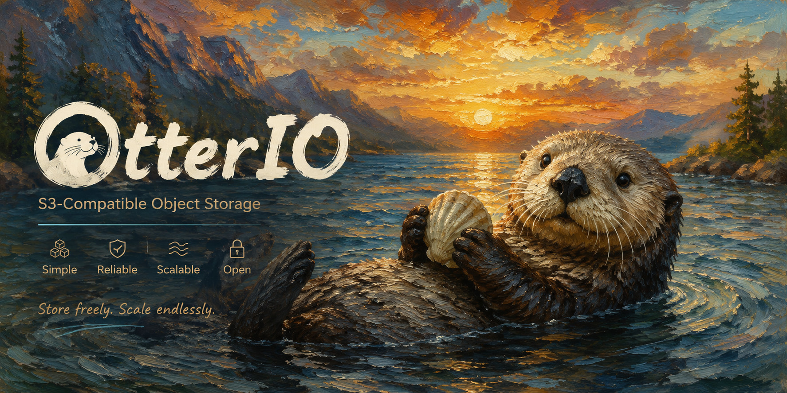
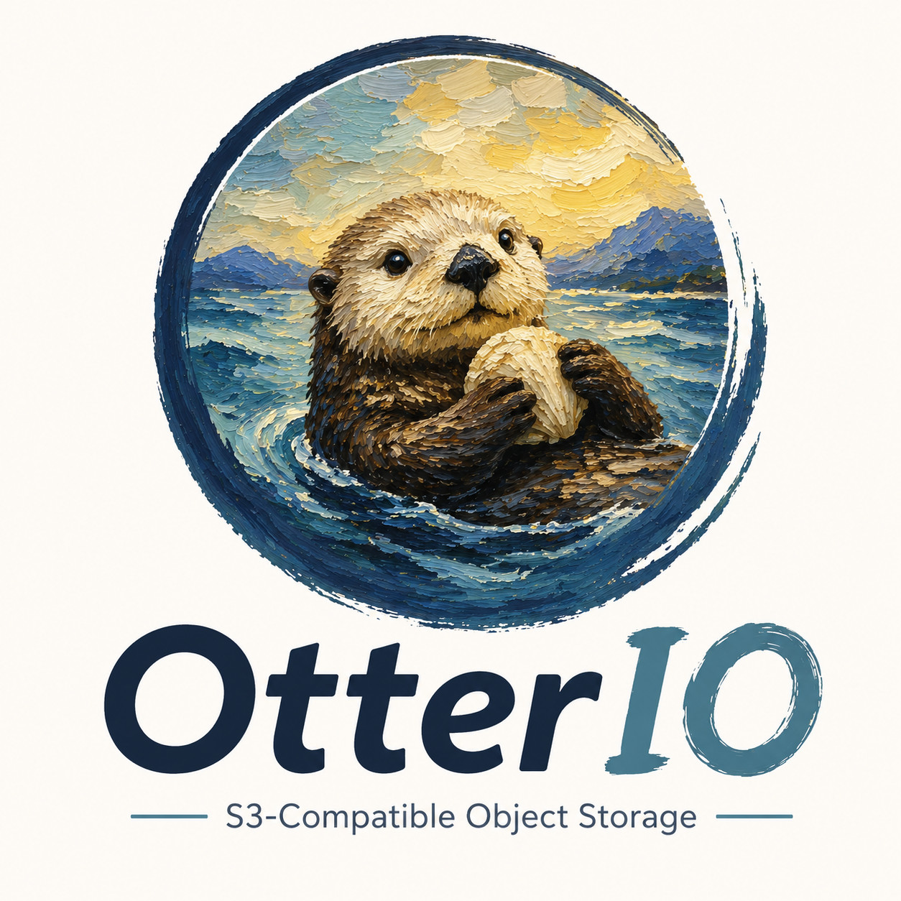

<div align="center">

[](https://github.com/soulteary/otterio)

# OtterIO

**S3-Compatible Object Storage** — _Store freely. Scale endlessly._

[](./LICENSE)
[](./go.mod)
[](https://github.com/soulteary/otterio)

English · [简体中文](./README_zh_CN.md)

</div>

OtterIO is a High Performance Object Storage. It is API compatible with the Amazon S3 cloud storage service. Use OtterIO to build high performance infrastructure for machine learning, analytics and application data workloads.

This README provides quickstart instructions on running OtterIO on baremetal hardware, including Docker-based installations.

> **⚠️ OtterIO is an independent, community-maintained fork of the upstream Apache-licensed MinIO codebase project.**
>
> This project is **NOT** affiliated with, endorsed by, or sponsored by MinIO, Inc.
> "MinIO" is a trademark of MinIO, Inc., used here solely to identify the upstream
> project from which this fork is derived. No trademark rights are granted by the
> Apache License 2.0 (see Section 6 of the license).
>
> OtterIO is based on the **last Apache License 2.0 release of MinIO**, prior to
> OtterIO's relicensing to the GNU AGPLv3, and remains distributed under the
> [Apache License, Version 2.0](./LICENSE). The original copyright notices of
> MinIO, Inc. and all third-party subcomponents are retained — see [`NOTICE`](./NOTICE).
>
> Project home: https://github.com/soulteary/otterio

## About OtterIO

OtterIO is a customized fork of MinIO and differs from upstream in the following ways:

- **HTTP layer**: the request router is built on [`gofiber/fiber/v3`](https://github.com/gofiber/fiber) instead of `gorilla/mux`.
- **Bucket notification targets**: only `elasticsearch`, `mysql`, `postgresql`, `redis`, and `webhook` are supported. The message-queue targets (Kafka, NATS, NATS Streaming, NSQ, AMQP, MQTT) have been removed.
- **Gateways**: only the `nas` and `s3` gateways remain. The `azure`, `gcs`, and `hdfs` gateways have been removed.
- **Toolchain**: requires Go `1.26` or newer (see `go.mod`).

> NOTE: OtterIO publishes its own container images at `soulteary/otterio`
> (Docker Hub) and `ghcr.io/soulteary/otterio` (GitHub Container Registry).
> Other upstream links in this guide (`docs.min.io`, `dl.min.io`, etc.) still
> refer to the **original upstream project**, not to OtterIO. Build OtterIO from
> source (see [Install from Source](#install-from-source)) to use the
> customizations above.

# Docker Installation

Use the following commands to run a standalone OtterIO server on a Docker container.

Standalone OtterIO servers are best suited for early development and evaluation. Certain features such as versioning, object locking, and bucket replication
require distributed deploying OtterIO with Erasure Coding. For extended development and production, deploy OtterIO with Erasure Coding enabled - specifically,
with a *minimum* of 4 drives per OtterIO server. See [OtterIO Erasure Code Quickstart Guide](https://docs.min.io/docs/minio-erasure-code-quickstart-guide.html)
for more complete documentation.

OtterIO publishes its own container images to both Docker Hub and the GitHub Container Registry. Pull whichever registry is most convenient:

```sh
# Docker Hub
docker pull soulteary/otterio:latest

# GitHub Container Registry
docker pull ghcr.io/soulteary/otterio:latest
```

## Stable

Run the following command to run the latest stable image of OtterIO on a Docker container using an ephemeral data volume:

```sh
docker run -p 9000:9000 soulteary/otterio:latest server /data
```

The OtterIO deployment starts using default root credentials `otterioadmin:otterioadmin`. You can test the deployment using the OtterIO Browser, an embedded
web-based object browser built into OtterIO Server. Point a web browser running on the host machine to http://127.0.0.1:9000 and log in with the
root credentials. You can use the Browser to create buckets, upload objects, and browse the contents of the OtterIO server.

You can also connect using any S3-compatible tool, such as the OtterIO Client `mc` commandline tool. See
[Test using OtterIO Client `mc`](#test-using-otterio-client-mc) for more information on using the `mc` commandline tool. For application developers,
see https://docs.min.io/docs/ and click **MINIO SDKS** in the navigation to view OtterIO SDKs for supported languages.


> NOTE: To deploy OtterIO on Docker with persistent storage, you must map local persistent directories from the host OS to the container using the
  `docker -v` option. For example, `-v /mnt/data:/data` maps the host OS drive at `/mnt/data` to `/data` on the Docker container.

## Edge

Run the following command to run the bleeding-edge image of OtterIO on a Docker container using an ephemeral data volume:

```sh
docker run -p 9000:9000 soulteary/otterio:edge server /data
```

The OtterIO deployment starts using default root credentials `otterioadmin:otterioadmin`. You can test the deployment using the OtterIO Browser, an embedded
web-based object browser built into OtterIO Server. Point a web browser running on the host machine to http://127.0.0.1:9000 and log in with the
root credentials. You can use the Browser to create buckets, upload objects, and browse the contents of the OtterIO server.

You can also connect using any S3-compatible tool, such as the OtterIO Client `mc` commandline tool. See
[Test using OtterIO Client `mc`](#test-using-otterio-client-mc) for more information on using the `mc` commandline tool. For application developers,
see https://docs.min.io/docs/ and click **MINIO SDKS** in the navigation to view OtterIO SDKs for supported languages.


> NOTE: To deploy OtterIO on Docker with persistent storage, you must map local persistent directories from the host OS to the container using the
  `docker -v` option. For example, `-v /mnt/data:/data` maps the host OS drive at `/mnt/data` to `/data` on the Docker container.

# macOS

Use the following commands to run a standalone OtterIO server on macOS.

Standalone OtterIO servers are best suited for early development and evaluation. Certain features such as versioning, object locking, and bucket replication
require distributed deploying OtterIO with Erasure Coding. For extended development and production, deploy OtterIO with Erasure Coding enabled - specifically,
with a *minimum* of 4 drives per OtterIO server. See [OtterIO Erasure Code Quickstart Guide](https://docs.min.io/docs/minio-erasure-code-quickstart-guide.html)
for more complete documentation.

## Homebrew (recommended)

Run the following command to install the latest stable OtterIO package using [Homebrew](https://brew.sh/). Replace ``/data`` with the path to the drive or directory in which you want OtterIO to store data.

```sh
brew install otterio/stable/otterio
otterio server /data
```

> NOTE: If you previously installed otterio using `brew install otterio` then it is recommended that you reinstall otterio from `otterio/stable/otterio` official repo instead.

```sh
brew uninstall otterio
brew install otterio/stable/otterio
```

The OtterIO deployment starts using default root credentials `otterioadmin:otterioadmin`. You can test the deployment using the OtterIO Browser, an embedded
web-based object browser built into OtterIO Server. Point a web browser running on the host machine to http://127.0.0.1:9000 and log in with the
root credentials. You can use the Browser to create buckets, upload objects, and browse the contents of the OtterIO server.

You can also connect using any S3-compatible tool, such as the OtterIO Client `mc` commandline tool. See
[Test using OtterIO Client `mc`](#test-using-otterio-client-mc) for more information on using the `mc` commandline tool. For application developers,
see https://docs.min.io/docs/ and click **MINIO SDKS** in the navigation to view OtterIO SDKs for supported languages.

## Binary Download

Use the following command to download and run a standalone OtterIO server on macOS. Replace ``/data`` with the path to the drive or directory in which you want OtterIO to store data.

```sh
wget https://dl.min.io/server/minio/release/darwin-amd64/minio
chmod +x otterio
./otterio server /data
```

The OtterIO deployment starts using default root credentials `otterioadmin:otterioadmin`. You can test the deployment using the OtterIO Browser, an embedded
web-based object browser built into OtterIO Server. Point a web browser running on the host machine to http://127.0.0.1:9000 and log in with the
root credentials. You can use the Browser to create buckets, upload objects, and browse the contents of the OtterIO server.

You can also connect using any S3-compatible tool, such as the OtterIO Client `mc` commandline tool. See
[Test using OtterIO Client `mc`](#test-using-otterio-client-mc) for more information on using the `mc` commandline tool. For application developers,
see https://docs.min.io/docs/ and click **MINIO SDKS** in the navigation to view OtterIO SDKs for supported languages.


# GNU/Linux

Use the following command to run a standalone OtterIO server on Linux hosts running 64-bit Intel/AMD architectures. Replace ``/data`` with the path to the drive or directory in which you want OtterIO to store data.

```sh
wget https://dl.min.io/server/minio/release/linux-amd64/minio
chmod +x otterio
./otterio server /data
```

Replace ``/data`` with the path to the drive or directory in which you want OtterIO to store data.

The following table lists supported architectures. Replace the `wget` URL with the architecture for your Linux host.

| Architecture                   | URL                                                        |
| --------                       | ------                                                     |
| 64-bit Intel/AMD               | https://dl.min.io/server/minio/release/linux-amd64/minio   |
| 64-bit ARM                     | https://dl.min.io/server/minio/release/linux-arm64/minio   |
| 64-bit PowerPC LE (ppc64le)    | https://dl.min.io/server/minio/release/linux-ppc64le/minio |
| IBM Z-Series (S390X)           | https://dl.min.io/server/minio/release/linux-s390x/minio   |

The OtterIO deployment starts using default root credentials `otterioadmin:otterioadmin`. You can test the deployment using the OtterIO Browser, an embedded
web-based object browser built into OtterIO Server. Point a web browser running on the host machine to http://127.0.0.1:9000 and log in with the
root credentials. You can use the Browser to create buckets, upload objects, and browse the contents of the OtterIO server.

You can also connect using any S3-compatible tool, such as the OtterIO Client `mc` commandline tool. See
[Test using OtterIO Client `mc`](#test-using-otterio-client-mc) for more information on using the `mc` commandline tool. For application developers,
see https://docs.min.io/docs/ and click **MINIO SDKS** in the navigation to view OtterIO SDKs for supported languages.


> NOTE: Standalone OtterIO servers are best suited for early development and evaluation. Certain features such as versioning, object locking, and bucket replication
require distributed deploying OtterIO with Erasure Coding. For extended development and production, deploy OtterIO with Erasure Coding enabled - specifically,
with a *minimum* of 4 drives per OtterIO server. See [OtterIO Erasure Code Quickstart Guide](https://docs.min.io/docs/minio-erasure-code-quickstart-guide.html)
for more complete documentation.

# Microsoft Windows

To run OtterIO on 64-bit Windows hosts, download the OtterIO executable from the following URL:

```sh
https://dl.min.io/server/minio/release/windows-amd64/minio.exe
```

Use the following command to run a standalone OtterIO server on the Windows host. Replace ``D:\`` with the path to the drive or directory in which you want OtterIO to store data. You must change the terminal or powershell directory to the location of the ``otterio.exe`` executable, *or* add the path to that directory to the system ``$PATH``:

```sh
otterio.exe server D:\
```

The OtterIO deployment starts using default root credentials `otterioadmin:otterioadmin`. You can test the deployment using the OtterIO Browser, an embedded
web-based object browser built into OtterIO Server. Point a web browser running on the host machine to http://127.0.0.1:9000 and log in with the
root credentials. You can use the Browser to create buckets, upload objects, and browse the contents of the OtterIO server.

You can also connect using any S3-compatible tool, such as the OtterIO Client `mc` commandline tool. See
[Test using OtterIO Client `mc`](#test-using-otterio-client-mc) for more information on using the `mc` commandline tool. For application developers,
see https://docs.min.io/docs/ and click **MINIO SDKS** in the navigation to view OtterIO SDKs for supported languages.

> NOTE: Standalone OtterIO servers are best suited for early development and evaluation. Certain features such as versioning, object locking, and bucket replication
require distributed deploying OtterIO with Erasure Coding. For extended development and production, deploy OtterIO with Erasure Coding enabled - specifically,
with a *minimum* of 4 drives per OtterIO server. See [OtterIO Erasure Code Quickstart Guide](https://docs.min.io/docs/minio-erasure-code-quickstart-guide.html)
for more complete documentation.

# FreeBSD

OtterIO does not provide an official FreeBSD binary. However, FreeBSD maintains an [upstream release](https://www.freshports.org/www/otterio) using [pkg](https://github.com/freebsd/pkg):

```sh
pkg install otterio
sysrc otterio_enable=yes
sysrc otterio_disks=/home/user/Photos
service otterio start
```

# Install from Source

Use the following commands to compile and run a standalone OtterIO server from source. Source installation is only intended for developers and advanced users. If you do not have a working Golang environment, please follow [How to install Golang](https://golang.org/doc/install). OtterIO requires **Go 1.26 or newer** (see `go.mod`).

To build OtterIO (with the Fiber-based router and other customizations), clone and build it directly:

```sh
git clone https://github.com/soulteary/otterio.git
cd otterio
make build
./otterio server /data
```

The OtterIO deployment starts using default root credentials `otterioadmin:otterioadmin`. You can test the deployment using the OtterIO Browser, an embedded
web-based object browser built into OtterIO Server. Point a web browser running on the host machine to http://127.0.0.1:9000 and log in with the
root credentials. You can use the Browser to create buckets, upload objects, and browse the contents of the OtterIO server.

You can also connect using any S3-compatible tool, such as the OtterIO Client `mc` commandline tool. See
[Test using OtterIO Client `mc`](#test-using-otterio-client-mc) for more information on using the `mc` commandline tool. For application developers,
see https://docs.min.io/docs/ and click **MINIO SDKS** in the navigation to view OtterIO SDKs for supported languages.


> NOTE: Standalone OtterIO servers are best suited for early development and evaluation. Certain features such as versioning, object locking, and bucket replication
require distributed deploying OtterIO with Erasure Coding. For extended development and production, deploy OtterIO with Erasure Coding enabled - specifically,
with a *minimum* of 4 drives per OtterIO server. See [OtterIO Erasure Code Quickstart Guide](https://docs.min.io/docs/minio-erasure-code-quickstart-guide.html)
for more complete documentation.

OtterIO strongly recommends *against* using compiled-from-source OtterIO servers for production environments.

# Deployment Recommendations

## Run S3 and Web Console on Separate Ports

By default the web console and the S3 API share the listener bound to `--address`. Since the recent split-listener change, OtterIO can serve the web UI and the admin API on a dedicated port so reverse proxies, firewalls, and network policies can govern S3 traffic and console traffic independently.

Enable the dedicated console listener via the `--console-address` flag or the `OTTERIO_BROWSER_ADDRESS` environment variable:

```sh
# CLI flag
otterio server --address ":9000" --console-address ":9001" /data

# environment variable (equivalent)
export OTTERIO_BROWSER_ADDRESS=":9001"
otterio server --address ":9000" /data
```

When the dedicated console listener is enabled:

- `:9000` only serves the S3 API, STS, health, and metrics. Browser requests are no longer redirected to the web UI.
- `:9001` serves the web console (`/otterio/`) and the admin API (`/otterio/admin/v3/*`).
- The console port must differ from the S3 port; otherwise startup fails fast.
- `Ctrl+C` / `SIGTERM` shuts down both listeners gracefully.

> Note: the admin API (used by `mc admin ...`) is served from the console port in this mode. Configure your `mc` alias to point at the console URL when issuing admin commands. Regular S3 operations (`mc cp`, `mc ls`, etc.) continue to use the S3 port.

If `--console-address` is not provided, both surfaces continue to share a single port (the original behaviour).

### Dedicated TLS certificates for the console listener

When you split listeners, you can also point the console at its own TLS keypair so the S3 API and the web console can use different certificates (e.g. an internal CA-signed cert for `:9000` and a public cert for `:9001`). Use `--console-certs-dir` or `OTTERIO_BROWSER_CERTS_DIR`:

```sh
otterio server \
  --address ":9000" \
  --console-address ":9001" \
  --certs-dir /etc/otterio/certs/s3 \
  --console-certs-dir /etc/otterio/certs/console \
  /data
```

The directory pointed to by `--console-certs-dir` must contain `public.crt` and `private.key`, the same layout used by `--certs-dir`. Notes:

- `--console-certs-dir` requires `--console-address`; otherwise startup fails fast.
- If `--console-certs-dir` is not set, the console listener reuses the certificates loaded from `--certs-dir` (the legacy behaviour).
- The S3 listener always uses `--certs-dir`; only the console listener honours `--console-certs-dir`.
- Both keypairs are watched and hot-reloaded by the same certificate manager used for `--certs-dir`.

## Allow port access for Firewalls

By default OtterIO uses the port 9000 to listen for incoming connections. If your platform blocks the port by default, you may need to enable access to the port.

### ufw

For hosts with ufw enabled (Debian based distros), you can use `ufw` command to allow traffic to specific ports. Use below command to allow access to port 9000

```sh
ufw allow 9000
```

Below command enables all incoming traffic to ports ranging from 9000 to 9010.

```sh
ufw allow 9000:9010/tcp
```

### firewall-cmd

For hosts with firewall-cmd enabled (CentOS), you can use `firewall-cmd` command to allow traffic to specific ports. Use below commands to allow access to port 9000

```sh
firewall-cmd --get-active-zones
```

This command gets the active zone(s). Now, apply port rules to the relevant zones returned above. For example if the zone is `public`, use

```sh
firewall-cmd --zone=public --add-port=9000/tcp --permanent
```

Note that `permanent` makes sure the rules are persistent across firewall start, restart or reload. Finally reload the firewall for changes to take effect.

```sh
firewall-cmd --reload
```

### iptables

For hosts with iptables enabled (RHEL, CentOS, etc), you can use `iptables` command to enable all traffic coming to specific ports. Use below command to allow
access to port 9000

```sh
iptables -A INPUT -p tcp --dport 9000 -j ACCEPT
service iptables restart
```

Below command enables all incoming traffic to ports ranging from 9000 to 9010.

```sh
iptables -A INPUT -p tcp --dport 9000:9010 -j ACCEPT
service iptables restart
```

## Pre-existing data
When deployed on a single drive, OtterIO server lets clients access any pre-existing data in the data directory. For example, if OtterIO is started with the command  `otterio server /mnt/data`, any pre-existing data in the `/mnt/data` directory would be accessible to the clients.

The above statement is also valid for all gateway backends.

# Test OtterIO Connectivity

## Test using OtterIO Browser
OtterIO Server comes with an embedded web based object browser. Point your web browser to http://127.0.0.1:9000 to ensure your server has started successfully.


## Test using OtterIO Client `mc`
`mc` provides a modern alternative to UNIX commands like ls, cat, cp, mirror, diff etc. It supports filesystems and Amazon S3 compatible cloud storage services. Follow the OtterIO Client [Quickstart Guide](https://docs.min.io/docs/minio-client-quickstart-guide) for further instructions.

# Explore Further
- [OtterIO Erasure Code QuickStart Guide](https://docs.min.io/docs/minio-erasure-code-quickstart-guide)
- [Use `mc` with OtterIO Server](https://docs.min.io/docs/minio-client-quickstart-guide)
- [Use `aws-cli` with OtterIO Server](https://docs.min.io/docs/aws-cli-with-minio)
- [Use `s3cmd` with OtterIO Server](https://docs.min.io/docs/s3cmd-with-minio)
- [Use `otterio-go` SDK with OtterIO Server](https://docs.min.io/docs/golang-client-quickstart-guide)
- [The OtterIO documentation website](https://docs.min.io)

# Contribute to OtterIO
Contributions to OtterIO are welcome via its repository at https://github.com/soulteary/otterio.
For the upstream project's conventions, see the original OtterIO [Contributor's Guide](https://github.com/minio/minio/blob/master/CONTRIBUTING.md).

# License

<div align="center">



</div>

OtterIO is governed by the Apache License, Version 2.0, found at [LICENSE](./LICENSE).
Attribution and third-party notices are listed in [NOTICE](./NOTICE).

"MinIO" is a trademark of MinIO, Inc. OtterIO is not affiliated with, endorsed by,
or sponsored by MinIO, Inc.
