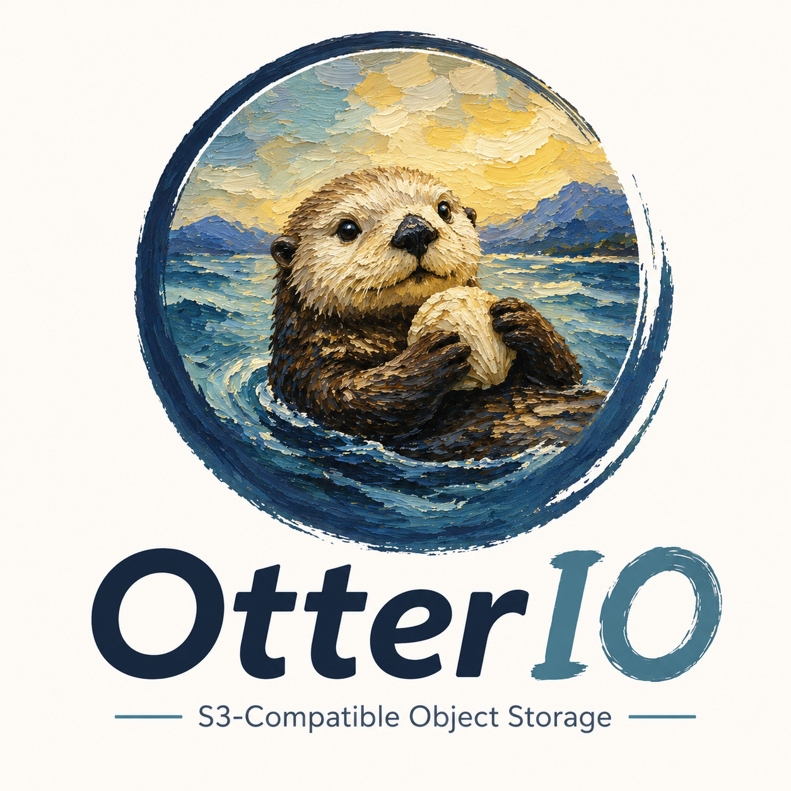

<div align="center">

[](https://github.com/soulteary/otterio)

# OtterIO

**S3 兼容对象存储** — _自由存储，无限扩展。_

[](./LICENSE)
[](./go.mod)
[](https://github.com/soulteary/otterio)

[English](./README.md) · 简体中文

</div>

OtterIO 是一个高性能、S3 兼容的对象存储服务，适合用于机器学习、数据分析、备份归档及通用应用数据等场景。

本文档涵盖裸金属、Docker 与源码运行方式。[文档索引](./docs/zh_CN/README.md)按部署、管理、安全与开发整理了阅读入口；[OC](https://github.com/soulteary/oc) 是配套命令行客户端，[OtterIO SDK](https://github.com/soulteary/otterio-sdk) 是 Go 客户端。

> [!IMPORTANT]
> OtterIO 是一个独立的、由社区维护的 MinIO 分支。本项目**未**获得 MinIO, Inc. 的关联、认可或赞助。部署前请阅读[商标与上游声明](#商标与上游声明)与[安全公告](#安全公告)。

---

## 关于 OtterIO

OtterIO 是 MinIO **最后一个 Apache License 2.0 版本**（约 `RELEASE.2021-04-22T15-44-28Z`）的定制 fork，与上游主要存在以下差异：

- **HTTP 层** —— 请求路由基于 [`gofiber/fiber/v3`](https://github.com/gofiber/fiber)，不再使用 `gorilla/mux`。
- **桶通知目标** —— 仅保留 `elasticsearch`、`mysql`、`postgresql`、`redis`、`webhook`，已移除消息队列类目标（Kafka、NATS、NATS Streaming、NSQ、AMQP、MQTT）。
- **网关** —— 仅保留 `nas` 与 `s3`，已移除 `azure`、`gcs`、`hdfs`。
- **构建工具链** —— 要求 Go `1.27.2` 及以上版本（详见 [`go.mod`](./go.mod)）；请使用最新补丁版本以获取安全修复。
- **容器镜像** —— 发布在 `soulteary/otterio`（Docker Hub）和 `ghcr.io/soulteary/otterio`（GitHub 容器镜像仓库）。

OtterIO 继续以 [Apache License, Version 2.0](./LICENSE) 分发，所有原始版权声明予以保留 —— 详见 [`NOTICE`](./NOTICE)。

---

## 快速开始

先设置自定义凭据，再使用 Docker 启动单节点 OtterIO。下面的密码生成命令需要 OpenSSL。请妥善保存生成的凭据，重启或在新终端连接时使用同一组值，不要为了重新连接而重新生成密码。

```sh
export OTTERIO_ROOT_USER=otterio-admin
OTTERIO_ROOT_PASSWORD="$(openssl rand -hex 32)"
export OTTERIO_ROOT_PASSWORD

docker run -p 127.0.0.1:9000:9000 -p 127.0.0.1:9001:9001 \
  -e OTTERIO_ROOT_USER -e OTTERIO_ROOT_PASSWORD \
  -v /mnt/data:/data \
  soulteary/otterio:latest server --console-address ":9001" /data
```

控制台地址为 <http://127.0.0.1:9001>，请使用刚才配置的用户名和密码登录。OC 连接及上传、下载检查见[验证部署](#验证部署)。

> [!IMPORTANT]
> 容器启动现在会拒绝缺失凭据或默认密码。升级前请修正旧的不带凭据的 Docker 启动命令。`_FILE` Secret、非 root Compose 配置和迁移步骤见 [Docker 安全指南](./README_DOCKER_SECURITY.md)。仅本地开发演示可显式设置 `OTTERIO_ALLOW_DEFAULT_CREDENTIALS=1` 允许默认凭据，并应将端口绑定到回环地址。生产部署请固定经过验证的版本标签或镜像 digest，而不是使用 `latest`。

> [!NOTE]
> 单盘服务没有纠删冗余。每个纠删集包含 **4–16 块磁盘**，可在单机使用，也可分布到多台服务器；受支持的分布式拓扑并不要求每台服务器都有四块盘。部署前应规划故障域，并核对每个纠删集的读写仲裁。详见[纠删码](./docs/zh_CN/erasure/README.md)、[分布式部署](./docs/zh_CN/distributed/README.md)与[服务限制](./docs/zh_CN/otterio-limits.md)。

---

## 安装方式

### Docker

OtterIO 同时发布在 Docker Hub 与 GitHub 容器镜像仓库，按需任选其一拉取：

```sh
# Docker Hub
docker pull soulteary/otterio:latest

# GitHub 容器镜像仓库（GHCR）
docker pull ghcr.io/soulteary/otterio:latest
```

| 标签     | 说明                                              |
| -------- | ------------------------------------------------- |
| `latest` | 最新稳定版。                                      |
| `edge`   | 来自 `main` 分支的尝鲜构建，仅供测试使用。        |

临时测试可使用[快速开始](#快速开始)中已配置的凭据启动单机实例，由 Docker 创建匿名数据卷。`--rm` 会在停止时删除容器及匿名卷：

```sh
: "${OTTERIO_ROOT_USER:?请先设置已保存的用户名}"
: "${OTTERIO_ROOT_PASSWORD:?请先设置已保存的密码}"
export OTTERIO_ROOT_USER OTTERIO_ROOT_PASSWORD
docker run --rm -p 127.0.0.1:9000:9000 \
  -e OTTERIO_ROOT_USER -e OTTERIO_ROOT_PASSWORD \
  soulteary/otterio:latest server /data
```

挂载宿主机目录以使用持久化存储：

```sh
: "${OTTERIO_ROOT_USER:?请先设置已保存的用户名}"
: "${OTTERIO_ROOT_PASSWORD:?请先设置已保存的密码}"
export OTTERIO_ROOT_USER OTTERIO_ROOT_PASSWORD
docker run -p 127.0.0.1:9000:9000 \
  -e OTTERIO_ROOT_USER -e OTTERIO_ROOT_PASSWORD \
  -v /mnt/data:/data soulteary/otterio:latest server /data
```

### macOS

从 [GitHub Releases](https://github.com/soulteary/otterio/releases) 下载 Apple Silicon 对应的 `otterio-darwin-arm64` 或 Intel 对应的 `otterio-darwin-amd64`，以及同一版本的 `otterio-<TAG>-checksums.txt`。产物是独立二进制，不是压缩包。先用 `shasum -a 256` 与校验文件中的对应记录比对，详见[发布验证步骤](./docs/releasing.md#4-verify-before-announcing)。Apple Silicon 示例：

```sh
mv otterio-darwin-arm64 otterio
chmod +x otterio
mkdir -p "$HOME/otterio-data"
./otterio server "$HOME/otterio-data"
```

启动前请按[快速开始](#快速开始)设置并导出已保存的 `OTTERIO_ROOT_USER` 和 `OTTERIO_ROOT_PASSWORD`。发布流程不提供 Homebrew tap。

### Linux

从同一 [GitHub Release](https://github.com/soulteary/otterio/releases) 下载 `otterio-linux-<arch>` 与 `otterio-<TAG>-checksums.txt`。先用 `sha256sum` 比对校验文件中的对应记录，再重命名为 `otterio`。amd64 主机示例：

```sh
mv otterio-linux-amd64 otterio
chmod +x otterio
mkdir -p "$HOME/otterio-data"
./otterio server "$HOME/otterio-data"
```

启动前请导出已保存的 root 凭据。校验方法见[发布验证步骤](./docs/releasing.md#4-verify-before-announcing)。

构建流水线 ([`release.yml`](./.github/workflows/release.yml)) 当前为 Linux 提供如下架构的产物：

| 架构                   | `goarch`   |
| ---------------------- | ---------- |
| 64 位 Intel/AMD        | `amd64`    |
| 64 位 ARM              | `arm64`    |
| 64 位 PowerPC LE       | `ppc64le`  |

Tag 发布流程提供独立二进制与 SHA-256 校验文件，不提供 `.deb` 或 `.rpm` 软件包。发布步骤见[发布指南](./docs/releases/README.md)。

### Windows

从同一 [GitHub Release](https://github.com/soulteary/otterio/releases) 下载 `otterio-windows-amd64.exe` 与 `otterio-<TAG>-checksums.txt`。先将 `(Get-FileHash .\otterio-windows-amd64.exe -Algorithm SHA256).Hash` 与校验文件中的对应记录比对，再通过 PowerShell 运行：

```powershell
Rename-Item .\otterio-windows-amd64.exe otterio.exe
# 输入为本次部署保存的非默认凭据。
$env:OTTERIO_ROOT_USER = Read-Host 'Root username'
$env:OTTERIO_ROOT_PASSWORD = Read-Host 'Root password' -MaskInput
New-Item -ItemType Directory -Force D:\otterio-data | Out-Null
.\otterio.exe server D:\otterio-data
```

[`Read-Host -MaskInput`](https://learn.microsoft.com/en-us/powershell/module/microsoft.powershell.utility/read-host#-maskinput) 需要 PowerShell 7.1 或更新版本；也可以由密钥管理工具提供环境变量。

### FreeBSD

OtterIO 当前没有官方发布的 FreeBSD 软件包。请按下文[源码构建](#源码构建)章节在 FreeBSD 上自行构建。

### 源码构建

源码安装仅供开发者与高级用户使用。请准备 Git、Make 与 Go 1.27.2 或更新版本（参见 [Go 安装文档](https://go.dev/doc/install)）；`make build` 会检查依赖并生成 `./otterio`。运行前请导出已保存的 root 凭据。

```sh
git clone https://github.com/soulteary/otterio.git
cd otterio
make build
mkdir -p "$HOME/otterio-data"
./otterio server "$HOME/otterio-data"
```

> [!WARNING]
> 强烈**不建议**在生产环境运行从源码自行构建的二进制。生产部署请使用打过 tag 的发行版本。

---

## 部署配置

### 拆分 S3 与 Web 控制台端口

默认情况下，Web 控制台与 S3 API 监听同一个端口（由 `--address` 指定）。OtterIO 支持把 Web UI 与 Admin API 拆分到独立的端口，方便在反向代理、防火墙或网络策略层面分别管控 S3 流量与控制台流量。

通过 `--console-address` 命令行参数或 `OTTERIO_BROWSER_ADDRESS` 环境变量启用：

```sh
otterio server --address ":9000" --console-address ":9001" /data
```

或使用环境变量（等效写法）：

```sh
export OTTERIO_BROWSER_ADDRESS=":9001"
otterio server --address ":9000" /data
```

启用拆分模式后：

- `:9000` 仅承载 S3 API、STS、HealthCheck、Metrics；浏览器请求不会再被重定向到 Web UI。
- `:9001` 承载 Web 控制台（`/otterio/`）以及 Admin API（`/otterio/admin/v3/*`）。
- 两个端口不能相同，否则启动会直接失败。
- `Ctrl+C` / `SIGTERM` 会同时优雅关停两个监听器。

> [!NOTE]
> 开启拆分模式后，Admin API（即 `oc admin ...` 使用的接口）位于控制台端口。OC 可在同一别名中保存 S3 URL 与独立的 `--admin-url`，见[验证部署](#验证部署)。普通 S3 操作（`oc cp`、`oc ls` 等）仍然走 S3 端口。两个端点的私有 CA 也可分别配置，见 [OC 配置指南](https://github.com/soulteary/oc/blob/main/docs/zh_CN/configuration.md)。

如未指定 `--console-address`，则保持原行为，二者共用同一个端口。

### 控制台监听器使用独立 TLS 证书

在拆分监听器的基础上，还可以通过 `--console-certs-dir`（或环境变量 `OTTERIO_BROWSER_CERTS_DIR`）让控制台使用独立的 TLS 证书，这样 S3 API 与 Web 控制台可以分别使用不同的证书（例如 `:9000` 用内部 CA 签发的证书，`:9001` 用公网证书）：

```sh
otterio server \
  --address ":9000" \
  --console-address ":9001" \
  --certs-dir /etc/otterio/certs/s3 \
  --console-certs-dir /etc/otterio/certs/console \
  /data
```

`--console-certs-dir` 指向的目录必须包含 `public.crt` 与 `private.key`，目录结构与 `--certs-dir` 相同。注意：

- `--console-certs-dir` 必须在已设置 `--console-address` 的情况下使用，否则启动会直接失败。
- 未指定 `--console-certs-dir` 时，控制台监听器复用 `--certs-dir` 加载的证书（与旧行为一致）。
- S3 监听器始终使用 `--certs-dir`，只有控制台监听器会读取 `--console-certs-dir`。
- 两套证书都由同一个证书管理器监视并热加载。

### 防火墙

OtterIO 默认监听端口 `9000`（拆分控制台后还会监听 `9001`）。某些系统会默认阻止这些端口，需要手动放行。

<details>
<summary><strong>ufw</strong>（Debian / Ubuntu）</summary>

```sh
ufw allow 9000

# 端口范围
ufw allow 9000:9010/tcp
```

</details>

<details>
<summary><strong>firewall-cmd</strong>（CentOS / RHEL）</summary>

```sh
firewall-cmd --get-active-zones
firewall-cmd --zone=public --add-port=9000/tcp --permanent
firewall-cmd --reload
```

`--permanent` 表示规则在重启与重新加载后依然生效。

</details>

<details>
<summary><strong>iptables</strong>（RHEL、CentOS 等）</summary>

```sh
iptables -A INPUT -p tcp --dport 9000 -j ACCEPT
service iptables restart

# 端口范围
iptables -A INPUT -p tcp --dport 9000:9010 -j ACCEPT
service iptables restart
```

</details>

### 已存在数据

在单块磁盘上部署 OtterIO 时，OtterIO Server 允许客户端访问数据目录下已经存在的内容。例如以 `otterio server /mnt/data` 启动后，`/mnt/data` 目录中已有的所有数据都可被客户端读取。该规则对所有网关后端同样成立。

---

## 验证部署

请使用启动时配置的凭据。上面的 Docker 示例传入 `OTTERIO_ROOT_USER` 和 `OTTERIO_ROOT_PASSWORD`，不使用默认密码。在新终端执行下面的客户端命令前，请恢复同一组已保存的值。裸金属二进制不受容器入口脚本检查约束，但部署前也应通过这两个环境变量设置非默认凭据。

### Web 控制台

快速开始示例已拆分监听器，请访问 <http://127.0.0.1:9001>；单端口部署则访问 <http://127.0.0.1:9000>。使用自己配置的 root 用户名和密码登录，即可创建桶、上传对象、浏览内容。

独立的可选 OC 控制台协议及最新证据见[分层控制台验收](docs/console-server-acceptance.md)和[最新报告入口](docs/console-server-acceptance-results.json)。

### OC 客户端

安装 [OC](https://github.com/soulteary/oc/blob/main/docs/zh_CN/installation.md)，用于 S3 对象操作与 OtterIO 管理。下面的示例对应快速开始中的双端口配置；OC 提示输入凭据时，请输入启动 OtterIO 所用的 root 用户名与密码：

```sh
oc alias set local http://127.0.0.1:9000 \
  --api s3v4 --path on --admin-url http://127.0.0.1:9001
oc mb local/otterio-quickstart
printf 'Hello from OtterIO\n' > otterio-hello.txt
oc cp otterio-hello.txt local/otterio-quickstart/hello.txt
oc cp local/otterio-quickstart/hello.txt otterio-downloaded.txt
cmp otterio-hello.txt otterio-downloaded.txt
oc ls local/otterio-quickstart/
oc admin info local
```

`cmp` 成功退出表示下载内容与原文件一致。示例会创建一个桶及两个本地文件；若已使用过该桶名，请改用其他名称。单端口部署请省略 `--admin-url`。应用程序应使用具备所需权限的 IAM access key，避免使用 root 凭据。

[OtterIO SDK](https://github.com/soulteary/otterio-sdk) 提供 Go 客户端与可运行的上传示例。`aws-cli`、`s3cmd`、上游 `mc` 等客户端也可连接 S3 端点，具体功能和签名行为仍需按业务验证。OtterIO 管理接口位于 `/otterio/admin/v3`；上游 `mc admin` 使用不同路径，请通过 OC 执行管理操作。

---

## 了解更多

### 项目自带文档（本仓库）

- [中文文档索引](./docs/zh_CN/README.md) · [English documentation index](./docs/README.md)
- [OC 命令行客户端](https://github.com/soulteary/oc) · [Go SDK](https://github.com/soulteary/otterio-sdk)
- [纠删码](./docs/erasure/README.md)
- [分布式部署](./docs/distributed/README.md)
- [多用户 / IAM](./docs/multi-user/README.md)
- [STS 临时凭据](./docs/sts/README.md)
- [TLS](./docs/tls/README.md)
- [KMS](./docs/kms/README.md)
- [桶通知](./docs/bucket/notifications/README.md)
- [桶复制](./docs/bucket/replication/README.md)
- [桶生命周期 / 保留 / 版本控制 / 配额](./docs/bucket)
- [指标与 Prometheus](./docs/metrics/README.md)
- [日志](./docs/logging/README.md)
- [Docker](./docs/zh_CN/docker/README.md) · [编排](./docs/zh_CN/orchestration/README.md)
- [安全公告积压清单](./docs/security/upstream-cve-backlog.md)
- [LDAP DN 规范化迁移](./docs/security/ldap-dn-normalization-migration.md)
- [服务限制](./docs/zh_CN/otterio-limits.md)

### 上游参考资料（第三方）

下列链接指向**原始上游 MinIO 项目**的文档，可作为 S3 兼容工作流的背景资料阅读，但描述的是上游 MinIO 行为，**不**由 OtterIO 维护：

- [纠删码快速入门](https://docs.min.io/docs/minio-erasure-code-quickstart-guide)（上游）
- [`mc` 客户端快速入门](https://docs.min.io/docs/minio-client-quickstart-guide)（上游）
- [使用 `aws-cli`](https://docs.min.io/docs/aws-cli-with-minio)（上游）
- [使用 `s3cmd`](https://docs.min.io/docs/s3cmd-with-minio)（上游）
- [Go SDK 快速入门](https://docs.min.io/docs/golang-client-quickstart-guide)（上游）

---

## 如何参与到 OtterIO 项目

感谢帮助项目发现问题、提供分析和提交补丁的贡献者，具体贡献见[项目致谢记录](ACKNOWLEDGMENTS.md)。

欢迎通过仓库 <https://github.com/soulteary/otterio> 参与贡献。本仓库的[贡献指南（英文）](./CONTRIBUTING.md)介绍代码结构、工具链与验证流程。[当前项目分析](./docs/development/project-status-20261008.md)记录了本次核对的源码、发布边界与文档缺口。

---

## 安全公告

<details>
<summary><strong>点击展开 —— 部署前请务必阅读。</strong></summary>

由于 OtterIO 派生自 **MinIO 最后一个 Apache 2.0 版本（约 `RELEASE.2021-04-22T15-44-28Z`）**，上游 `minio/minio` 在该版本之后发布的 CVE / GHSA **不会**自动被本项目继承，需要逐条评估并回填。

持续更新的[公告清单](./docs/security/upstream-cve-backlog.md)逐项记录适用性、源码修复与回归测试。源码已修复或条目已关闭，不代表你部署的正式版本已经包含修复；请核对所选标签与产物。新公告会以 `Pending` 状态纳入并跟踪。该记录不能代替具体部署的安全评估。

**从早期版本升级且使用 LDAP 的运维人员**请先阅读 [`docs/security/ldap-dn-normalization-migration.md`](./docs/security/ldap-dn-normalization-migration.md) 再上线：本次发布会在 LDAP DN 进入 IAM 策略表前先做规范化处理，这对于历史上依赖 DN 大小写差异区分多份映射的部署是一次性的破坏性变更。

**在采用 OtterIO 之前**，请结合自身部署场景做严谨的适用性评估：业务负载特征、容量与吞吐目标、合规与数据驻留要求、受支持版本策略，以及组织内部的变更管理规范。与任何基础设施组件一样，建议遵循实验室 → 预发 → 生产的分阶段灰度路径，并在贵方自有的回归测试集中验证相关代码路径。漏洞披露流程与受支持版本矩阵请参考 [`SECURITY.md`](./SECURITY.md)。

### 安全加固亮点

相对于 2021-04-22 的 Apache 协议 MinIO 基线，OtterIO 已经回填并（在有必要时进一步加固）下列上游公告，每一项的代码路径、上游引用与回归测试都列在 [`docs/security/upstream-cve-backlog.md`](./docs/security/upstream-cve-backlog.md)：

- **SSE 元数据注入**（GHSA-3rh2-v3gr-35p9 等价类）—— 路由入口与 `extractMetadata` 双层拒绝预留前缀的元数据。
- **Precondition GET / HEAD 元数据泄露**（GHSA-95fr-cm4m-q5p9 / CVE-2024-36107）—— 引入了一等公民的 `s3:ExistingObjectTag/*` / `s3:RequestObjectTag/*` 条件键，并在写出 `ETag` / `Last-Modified` 之前重新执行鉴权，按 tag 拒绝时不会再泄露对象状态。
- **SSE-KMS 上下文绑定**（2022 年后多个 CVE）—— 桶 / 对象 AAD 在每次封装与解封都从运行时 `(bucket, object)` 重建；恶意或被篡改的 `MetaContext` 会以独立的 403 sentinel 在调用 KMS 之前被拒绝；历史上七处返回 `ErrNotImplemented` 的 PUT 处理桩已经替换为单一的 `enforceSSEKMSRequest` 安全网关，覆盖单 PUT、分片上传、Copy、Post-Policy 路径。
- **Service Account 权限提升** —— GHSA-jjjj-jwhf-8rgr（自账户绕过创建 SA）、RELEASE.2025-10-15 sub-policy 越权、GHSA-xx8w-mq23-29g4 / CVE-2024-24747（admin:UpdateServiceAccount）均已关闭，并强制 sub-policy 必须是调用者能力的子集。
- **`AddUser` PolicyName 提权**（CVE-2021-43858）—— 在 handler 层（HTTP 400）与 IAM 层（静默剥离）双重防御。
- **LDAP DN 规范化族**（2022–2024 公告）—— 所有 DN 出口与 IAM 边界都做 RFC 4514 + RFC 4518 规范化，并附带一次性的持久数据迁移，详见上面的迁移说明。
- **桶 / IAM 策略反序列化** —— 修复了 `Principal` / `Resource` / `Action` 反序列化时的 panic，错误信息不再回显攻击者输入，并补充了 fuzz 语料。
- **SigV4 签名头与 chunked 上传硬化** —— 空的 `X-Amz-Content-Sha256` 现在被视为"未提供"，不再让规范化器误判；`SignedHeaders` 统一小写；aws-chunked 上传必须签 `x-amz-decoded-content-length`。
- **复制头 IAM 网关** —— 分叉私有的 `X-Otterio-Source-*` 头通过 `enforceSourceHeaderIAM` 强制走 `s3:ReplicateObject` 鉴权，关闭了使用普通 `s3:PutObject` / `s3:DeleteObject` 权限即可改写对象 mtime / ETag、强制写入 delete-marker 的伪造路径。
- **CVE-2023-28432 bootstrap 信息泄露** —— `VerifyHandler` 现在与 peer-rest / storage-rest / lock-rest 共用同一套节点间 JWT 校验，仅 `HealthHandler` 保留匿名访问。
- **多值 `Host` 头走私（分叉自身引入的关注点）** —— 已审计并钉死：fasthttp 与 net/http 都会在任何 handler 运行之前折叠或拒绝重复 Host 头，且 SigV4 仅读取标量 `r.Host`，因此双 Host 头走私在本分叉中无法构造。

另外两条上游公告（CVE-2021-41137 普通用户策略绕过、GHSA-cwq8-g58r-32hg `ImportIAM` 提权）经审计**不适用**于 2021-04 基线 —— 审计依据与负向钉死的回归测试参见上述 backlog。

</details>

---

## 商标与上游声明

<details>
<summary><strong>点击展开</strong></summary>

OtterIO 是一个独立的、由社区维护的上游 MinIO Apache 协议版本的项目分支。本项目**未**获得 MinIO, Inc. 的关联、认可或赞助。

"MinIO" 是 MinIO, Inc. 的商标，这里仅用于标识本分支所派生的上游项目。Apache License 2.0 不授予任何商标权（详见许可证第 6 节）。

OtterIO 基于 MinIO **在改用 GNU AGPLv3 之前的最后一个 Apache License 2.0 版本**，并继续以 [Apache License, Version 2.0](./LICENSE) 进行分发。MinIO, Inc. 及所有第三方子组件的原始版权声明均予以保留 —— 详见 [`NOTICE`](./NOTICE)。

OtterIO 在 [GitHub Releases](https://github.com/soulteary/otterio/releases) 提供自己的二进制，容器镜像发布在 `soulteary/otterio`（Docker Hub）和 `ghcr.io/soulteary/otterio`（GitHub 容器镜像仓库）。使用这些 OtterIO 产物或[从源码构建](#源码构建)即可获得本分支的定制能力。`docs.min.io`、`dl.min.io` 等链接指向**原始上游项目**。

项目主页：<https://github.com/soulteary/otterio>

</details>

---

## 授权许可

<div align="center">



</div>

OtterIO 的使用受 Apache License, Version 2.0 约束，你可以在 [LICENSE](./LICENSE) 查看许可，归属与第三方声明见 [NOTICE](./NOTICE)。

"MinIO" 是 MinIO, Inc. 的商标。OtterIO 未获得 MinIO, Inc. 的关联、认可或赞助。
