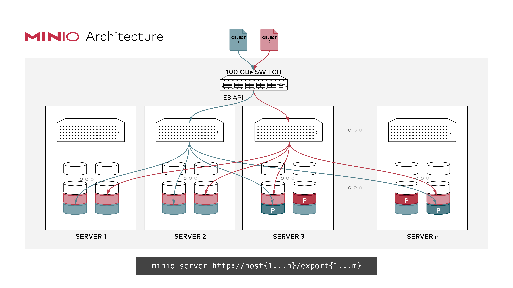

# Distributed OtterIO Quickstart Guide

Distributed OtterIO combines drive endpoints on multiple machines into one object storage deployment. Data is grouped into erasure sets; multiple sets form a server pool, and a deployment can contain multiple pools. Each object is stored in one erasure set, rather than being replicated to every node.

## Data protection and availability

OtterIO uses [erasure coding and checksums](../erasure/README.md) to recover missing or corrupted shards when enough healthy shards remain. The default `STANDARD` parity is 2 for 4–5-drive sets, 3 for 6–7-drive sets, and 4 for 8–16-drive sets. It is not always half of the set.

For a set of `N` drives with `P` parity shards, reading requires `N - P` healthy shards and usable metadata. Writing normally requires `N - P` drives; when data and parity counts are equal, writing requires one additional drive. Calculate node-failure tolerance from **how each node's drives are distributed across every set**. A deployment-wide percentage of online nodes or drives is insufficient: failures concentrated in one set can make its objects unavailable while other sets remain healthy.

For example, with four nodes contributing one drive each to a 4-drive set, default `EC:2` needs two healthy drives for reads and three for writes. Losing one node permits reads and writes; losing two nodes leaves enough shards for reads but not writes. With a 16-drive set at default `EC:4`, both reads and writes need twelve healthy drives, so only four failed drives in that set can be tolerated. Consult the [sizing examples](SIZING.md) and [storage classes](../erasure/storage-class/README.md) alongside your actual endpoint layout.

Successful object operations follow the server's read-after-write and list-after-write consistency model. Quorum failures must be handled by the client; availability depends on healthy drives, metadata, and connectivity.

## Prerequisites

- Install and configure OtterIO using the [Quick Start](../../README.md#quick-start).
- Use the same OtterIO version, saved root credentials (`OTTERIO_ROOT_USER` and `OTTERIO_ROOT_PASSWORD`), and endpoint arguments on every participating node.
- Prepare similarly sized physical drives and dedicated empty directories for a new deployment. Reuse the existing directories when restarting that deployment. Multiple directories on one disk share a failure domain.
- Ensure every node can resolve and reach every endpoint and that each node's advertised drive paths exist on that node. Use consistent endpoint schemes and ports.
- Synchronize node clocks. Inter-node requests enforce a 15-minute skew limit, so keep clocks much closer using a time synchronization service.
- Configure [TLS](../tls/README.md) for traffic that crosses untrusted networks. `OTTERIO_DOMAIN` is optional and is used when configuring virtual-host-style bucket access.

## Start the deployment

Run the same command on each of four hosts. The example uses four drives per host, mounted at `/export1` through `/export4`. Replace `host1` through `host4` with names that resolve to the participating nodes. The HTTP example assumes a controlled network; use `https://` after provisioning certificates for all endpoints.

```sh
: "${OTTERIO_ROOT_USER:?Set the shared saved username first}"
: "${OTTERIO_ROOT_PASSWORD:?Set the shared saved password first}"
export OTTERIO_ROOT_USER OTTERIO_ROOT_PASSWORD
otterio server 'http://host{1...4}:9000/export{1...4}'
```

Use OtterIO's literal three-dot range syntax (`{1...4}`) and quote the endpoint pattern. The server expands it and chooses a supported set size from 4 through 16 that divides the endpoint count while accounting for pattern symmetry. Shell expansion with `{1..4}` is a different syntax and can change endpoint ordering and grouping.



All nodes must agree on the complete endpoint list and ordering. Use a load balancer or a chosen node endpoint for client access, with a configuration that preserves S3 request signing.

## Add a server pool

Expansion adds a new pool; it does not enlarge or reorder the erasure sets already recorded on existing drives. Retain the original endpoint group and append a new group, then update the startup command on every participating node. For example, expand the preceding deployment with another four hosts:

```sh
otterio server 'http://host{1...4}:9000/export{1...4}' \
  'http://host{5...8}:9000/export{1...4}'
```

Prepare the new hosts and empty drive directories before restarting the deployment with the complete command. Plan the restart as a maintenance operation; this guide does not promise zero downtime. Each new pool must support the common parity count selected for the deployment; its total drive count need not equal the original pool's count.

Placement of new objects is weighted by available space in eligible pools. Within a pool, a deterministic hash chooses an erasure set. Adding a pool does not automatically move existing objects to the new pool or improve an existing object's redundancy. Capacity and node-failure tolerance remain tied to each pool's set layout.

**Lifecycle tier transitions are currently unavailable in distributed and multi-pool deployments.** The current durable ILM target protocol supports only native, single-pool, local erasure storage; see the [lifecycle guide](../bucket/lifecycle/README.md).

## Validate the deployment

Configure an S3 client such as `oc`, the AWS CLI, or the [OtterIO Go SDK](https://github.com/soulteary/otterio-sdk) for a client-facing endpoint. Verify bucket creation, upload, download checksums, and listing. In a disposable test cluster, test controlled node outages against the set-level read and write thresholds and verify recovery after the nodes return.

The [endpoint grouping](../../cmd/endpoint-ellipses.go), [pool initialization and placement](../../cmd/erasure-server-pool.go), and [quorum implementation](../../cmd/erasure-metadata.go) define the behavior described here. Upstream MinIO documentation can explain general S3 workflows, but it does not define the capabilities or limits of this OtterIO revision.
