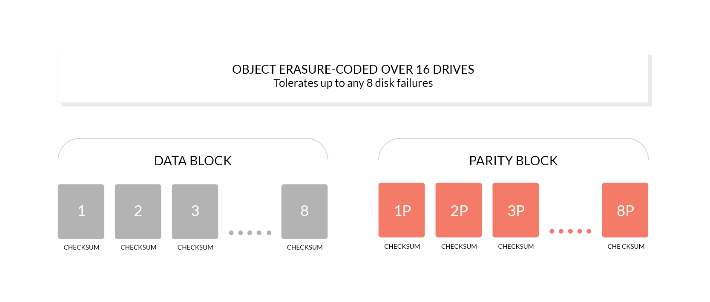

# OtterIO Erasure Code Quickstart Guide

OtterIO's erasure backend uses Reed-Solomon coding and checksums to recover missing or corrupted object shards. Recovery depends on the number of healthy shards in the object's **erasure set**, not the number of healthy drives in the entire deployment.

## Data, parity, and quorum

For a set of `N` drives with `P` parity shards, each object has `D = N - P` data shards. Reading requires at least `D` healthy shards with usable metadata. Writing normally requires `D` drives; when data and parity counts are equal, writing requires `D + 1` to avoid split-brain writes.

The default `STANDARD` parity depends on the set size:

- 4–5 drives: `EC:2`.
- 6–7 drives: `EC:3`.
- 8–16 drives: `EC:4`.

`REDUCED_REDUNDANCY` defaults to `EC:2`. You can configure parity using [storage classes](storage-class/README.md), up to `floor(N/2)` parity shards. This is not a default guarantee that half of all drives can fail.

For example, a 12-drive set uses **8 data and 4 parity** shards by default. With four failed drives in that set, existing objects can still be read and writes can still satisfy the 8-drive quorum. If explicitly configured with `EC:6`, the same set uses 6 data and 6 parity shards: six healthy drives can reconstruct data, while new writes need seven. These thresholds assume the remaining drives have healthy data and metadata; other errors can still prevent an operation.

Changing storage-class configuration affects new writes and does not rewrite the shards of existing objects. Check the parity used by the objects you need to protect when planning failure tolerance.

## Object healing and bit rot

Objects are encoded independently, so healing can repair an individual object's missing or damaged shards. Failed drives still need operational attention and replacement; erasure coding does not remove that requirement. Healing requires enough healthy shards to reconstruct the object.

The erasure backend uses [HighwayHash checksums](../../cmd/bitrot.go) to detect silent corruption, also called bit rot. Detection allows reconstruction when enough valid shards remain; it cannot recover data after losses exceed the object's redundancy.



## How drives are grouped

OtterIO groups drive endpoints into erasure sets of **4 to 16 drives**. Each object is written to one set. For local deployments using automatic grouping, it chooses the largest supported set size that divides the drive count: 18 drives become two sets of 9, and 24 drives become two sets of 12. Distributed endpoint patterns also affect grouping so that the generated layout is symmetric; see the [distributed guide](../distributed/README.md).

Use similarly sized drives and map each endpoint to its intended physical drive. Multiple directories on one disk share a failure domain and do not offer independent drive protection. Usable capacity also depends on parity and the smallest drives in each set.

## Start a local erasure deployment

Install and configure OtterIO using the [Quick Start](../../README.md#quick-start). With non-default root credentials already configured, start a 12-drive deployment:

```sh
otterio server '/data{1...12}'
```

For an 8-drive Docker deployment, first configure and securely save a non-default username and password as described in the [Quick Start](../../README.md#quick-start). Reuse the same credentials on restart; this example refuses to run until both values are set. See [Docker security](../../README_DOCKER_SECURITY.md) for `_FILE` secrets and non-root volume permissions. Production deployments should pin a reviewed release tag or digest instead of `latest`.

```sh
: "${OTTERIO_ROOT_USER:?Set your saved username first}"
: "${OTTERIO_ROOT_PASSWORD:?Set your saved password first}"
export OTTERIO_ROOT_USER OTTERIO_ROOT_PASSWORD
docker run -p 127.0.0.1:9000:9000 --name otterio \
  -e OTTERIO_ROOT_USER -e OTTERIO_ROOT_PASSWORD \
  -v /mnt/data1:/data1 \
  -v /mnt/data2:/data2 \
  -v /mnt/data3:/data3 \
  -v /mnt/data4:/data4 \
  -v /mnt/data5:/data5 \
  -v /mnt/data6:/data6 \
  -v /mnt/data7:/data7 \
  -v /mnt/data8:/data8 \
  soulteary/otterio:latest server '/data{1...8}'
```

The published port is available only on the Docker host. For remote access, use an authenticated, TLS-protected reverse proxy or a controlled network. Mount each `/mnt/dataN` on the intended drive; eight directories on one disk do not provide eight independent failure domains.

## Validate recovery

Use a disposable test deployment with known object contents and checksums. Confirm uploads and downloads while healthy, then simulate a controlled drive outage within the set's read and write thresholds, verify the expected operations, and restore the drive. Recheck object contents after healing. Do not infer production fault tolerance from directory count alone.

The implementation of [default parity](../../cmd/format-erasure.go), [write quorum](../../cmd/erasure-object.go), and [endpoint grouping](../../cmd/endpoint-ellipses.go) is the source of truth for this guide.
